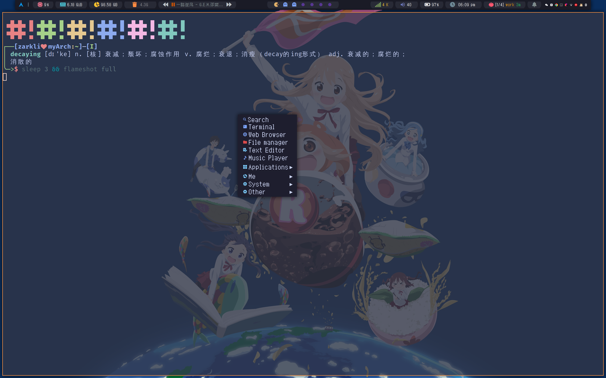

# Hacking to the Arch

[planning to switch to use wayland]  

## Overview

- Pannel: `polybar`
- Terminal: `alacritty`
- Shell: `fish`
- Menu(Application Launcher, etc.): `rofi` and `jgmenu`
- Display Manager: `lightdm` with `lightdm-slick-greeter`
- Screen Lock: `BetterScreenLock`
- Notification Manager: `dunst` 
- Editors(and IDE):
    - `emacs`: doom emacs [configuration](https://github.com/Ziqi-Yang/.doom.d)(in another repo)
    - `neovim`: astrovim [configuration](./dotfiles/config/nvim/lua/user/init.lua)
    - `Jetbrains IDE`: [.ideavimrc](./dotfiles/config/ideavimrc)
    - `vscode`(`code - oss`): [settings.json](<./dotfiles/config/Code - OSS/User/settings.json>)
    - `vim`: [extramely basic config for icpc](https://gist.github.com/Ziqi-Yang/2fd25c93254382c9e5b376568a0e9611) for algorithm competition
- File Manager: `rofi`
- Windows Manager: `bspwm` (with X hotkey daemon `sxhkd`)
- Compositor: `picom`([pijulius/picom](https://github.com/pijulius/picom))
- Pdf Reader: `zathura`
- Dotfile Syncer: initially [`dotfiles/myBin/sync.sh`](dotfiles/myBin/sync.sh) -> afterward [`dotdrop`](https://github.com/deadc0de6/dotdrop)

**Themes**: 
- ~~icon: `Deepin Icons 2022` [kde store](https://store.kde.org/p/1678986/) [github](https://github.com/zayronxio/Deepin-icons-2022)~~
- icon: `Tela-dracula` archlinux package name: `tele-icon-theme`
- grub: [GRUB-Theme](https://github.com/13atm01/GRUB-Theme)
- font: (the last 4 fonts is already included in this repo)
    - FiraCode Nerd Font: [aur](https://aur.archlinux.org/packages/nerd-fonts-fira-code) used for programming
    - [zpix](https://github.com/SolidZORO/zpix-pixel-font) pixel font
    - [Font Awesome 6 Free](https://fontawesome.com/download) icon
    - [Material Design Icons Desktop TTF](https://github.com/Templarian/MaterialDesign-Font) icon
    - [MesloLGS\_NF](https://github.com/romkatv/powerlevel10k-media/)
- cursor: [Google\_Cursor](https://github.com/ful1e5/Google_Cursor) (google-dot-blue)
- qt5: kvantum
- gtk: [Layan-gtk-theme](https://github.com/vinceliuice/Layan-gtk-theme)

## [Docs](https://ziqi-yang.github.io/dotfiles/#/)

On progress  
Previous docs can be found in the `docs_bak` folder

## Other Awesome Dotfiles

- [gh0stzk/dotfiles](https://github.com/gh0stzk/dotfiles)
- [tam-carre/dotfiles](https://github.com/tam-carre/dotfiles)
- [HynDuf7/dotfiles](https://github.com/HynDuf7/dotfiles)
- [Syndrizzle/hotfiles](https://github.com/Syndrizzle/hotfiles)
- [AmadeusWM/dotfiles-hyprland](https://github.com/AmadeusWM/dotfiles-hyprland)
- [lokesh-krishna/dotfiles](https://github.com/lokesh-krishna/dotfiles)

## Useful Links
__plan to delete the section__
1. [HiDPI - Arch Wiki](https://wiki.archlinux.org/title/HiDPI)
2. [Environment variables](https://wiki.archlinux.org/title/environment_variables)
